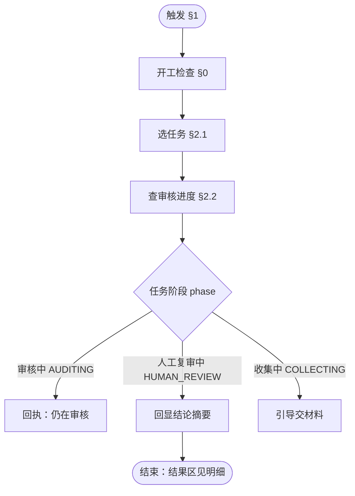

# Skill · 审核监控（DEMO · 只读）

**本 Skill 只负责**：审核员 **只读**查看任务审核进度与条款结论摘要。  
**前置**：第 2 步已 `confirm` 并触发 `runTask`；第 3 步跑完后任务进入 **`人工复审中`（`HUMAN_REVIEW`）**。

**不做**：催交、改派、手动启动 AI、导出、逐条确认、出报告。材料未收齐时 **不**在本 Skill 代交材料，引导陈志强走第 2 步提交材料。

---

## DEMO 对齐常量

| 项           | 值                                   |
| ----------- | ----------------------------------- |
| 任务 ID       | `AUD-202607-LX-001`                 |
| 基地          | 龙兴工厂                                |
| 周期          | 2026-07                             |
| 条款实例 ID（内部） | `HJ-GC-02`                          |
| 四级路径        | 过程（焊接） › 质量数据运用 › 指标监控分析 › 过程指标监控 |
| 审核员         | 张伟                                  |
| 被审核人        | 陈志强                                 |

---

## 0. 后端能力

| 工具                         | 管什么         | 动作（`action`）         |
| -------------------------- | ----------- | -------------------- |
| **执行工具**（`audit_execute`）  | 审核进度与结论（只读） | 查审核进度（`getProgress`） |
| **材料工具**（`audit_material`） | 任务列表（可选）    | 列待办任务（`listTasks`）   |

**开工检查**：先确认 **执行工具**（`audit_execute`）可用；不可用 →「后端能力未接入」，**不得**编造阶段、问题条数或建议分。  
**失败不兜底编造**：`getProgress` 失败就展示错误；**绝不**用推测值顶替结论。  
**只读免确认**：查进度属 Ask 档，**不出**【确认 / 取消】面板。

---

## 1. 触发

**按意图触发，不按固定关键字。**

| 类型    | 示例（非穷举）                             |
| ----- | ----------------------------------- |
| 查进度   | 「查进度」「看进度」「审核进度怎么样」                 |
| 看结论   | 「看审核结果」「AI 审完了吗」「结论出来了吗」            |
| 带任务语境 | 「看龙兴这次审核结果」「AUD-202607-LX-001 审得怎样」 |

**不触发**：发起审核、提交材料、催交、改派、导出、复审、报告。

### 1.1 谁用本 Skill（DEMO 无权限模型）

DEMO **不做**鉴权 / 组织层级 / 403 判权。角色靠 **固定账号 ↔ 固定专家** 切换。

| DEMO 账号（姓名） | 固定角色  | 打开的专家   | 用不用本 Skill   |
| ----------- | ----- | ------- | ------------ |
| **张伟**      | 审核员   | 审核员专家   | ✅ 本 Skill    |
| **陈志强**     | 被审核对象 | 被审核对象专家 | ❌ 走第 2 步提交材料 |

联调时：陈志强交齐并开审 → 执行侧审完 → 切 **张伟** 进审核员专家说「查进度」。

---

## 2. 主流程（Ask · 免确认）



会话内锚定 **任务 ID**（`taskId`）。DEMO 常态：1 任务 × 1 条款。

### 2.1 选任务

1. 用户原话已带可解析任务 ID → 直接锚定，进 §2.2。
2. 否则调 **列待办任务**（`listTasks`）。
3. **仅 1 条** → 自动锚定，不弹选任务面板。
4. **多条** →【底部选择面板·单选】按 **创建时间**（`createdAt`）倒序点选。
5. **0 条** → 结束。

**DEMO 常态（1 条，自动锚定）**

```
任务 AUD-202607-LX-001（龙兴工厂 · 2026-07）
```

**多条时（面板）**

```
你名下有多条任务，请选一条：

【底部选择面板·单选】
AUD-202607-LX-001｜龙兴工厂｜2026-07｜人工复审中
AUD-202606-LX-003｜龙兴工厂｜2026-06｜收集中
```

**0 条**

```
你当前没有可查看的审核任务。
```

> 数据依赖：`audit_material(action=listTasks)`，入参当前用户（`owner=me`）；出参任务列表（`tasks[]`）：任务 ID（`taskId`）、基地、周期、任务阶段（`phase`）。  
> 失败：展示错误，**不编造任务**。

### 2.2 查审核进度

锚定任务 ID（`taskId`）后调 **查审核进度**（`getProgress`）。

- **对话区**：只回 §2.2 的 **摘要**（阶段 + 每条款问题条数 + 条款分建议）。
- **结果区**：展示 **BIP 问题管理表**（见 §2.3），**不在对话区**贴整张表。

对用户展示 **四级路径**，**不念** 条款实例 ID（`clauseId`）。

#### 仍在审核（`AUDITING`）

```
任务 AUD-202607-LX-001（龙兴工厂 · 2026-07）
当前阶段：审核中（AUDITING）

AI 审核仍在进行，请稍后再查。
```

#### 材料未收齐（`COLLECTING`）

```
任务 AUD-202607-LX-001（龙兴工厂 · 2026-07）
当前阶段：收集中（COLLECTING）

材料尚未收齐，请联系被审核对象陈志强提交材料。
```

#### 人工复审中（DEMO 常态 · 有结论）

```
任务 AUD-202607-LX-001（龙兴工厂 · 2026-07）
当前阶段：人工复审中（HUMAN_REVIEW）

结论摘要（1 条）：
1. 过程（焊接） › 质量数据运用 › 指标监控分析 › 过程指标监控
   · 问题 2 条 · 条款分建议 6（待确认）

明细见结果区（BIP 问题管理表）。
```

> 数据依赖：`audit_execute(action=getProgress)`，入参 `taskId=AUD-202607-LX-001`；出参 `phase`、`clauseResults[]`（摘要）、`bipRows[]`（结果区表格，见 §2.3）。  
> DEMO 期望：`issuesCount=2`，`suggestedScore=6`，`bipRows` 长度 **2**。  
> 失败：展示错误，**不编造结论**。

### 2.3 结果区 · BIP 问题管理表

**结果区不是自由排版。** 有结论时（`phase=HUMAN_REVIEW`），结果区渲染 **BIP 问题管理表**，列定义与模板 **`各类报告模板汇总.xlsx` 第一个 Sheet「BIP 问题管理表」** 一致（12 列）：

| 列序 | 列名 | DEMO 怎么填 |
| --- | --- | --- |
| 1 | 时间 | 任务周期，如 `2026-07` |
| 2 | 制造基地 | 如 `龙兴工厂` |
| 3 | 序号 | 本任务内从 1 递增 |
| 4 | 区域 | BIP 区域列（本 DEMO 对应四级路径第 1 段，如 `过程（焊接）`） |
| 5 | 项目 | 四级路径第 2 段，如 `质量数据运用` |
| 6 | 子要素 | 四级路径第 3 段，如 `指标监控分析` |
| 7 | 条款 | 四级路径第 4 段或条款短标题，如 `过程指标监控` |
| 8 | 问题描述 | 第 3 步写回的 **问题描述**（**不含**「依据」） |
| 9 | 严重度（赋分） | 第 3 步写回的 **问题得分**，只能是 `0/2/4/6/8/10` |
| 10 | 问题属性 | 第 3 步写回的 **问题类型**（六类枚举） |
| 11 | 复核结论 | DEMO 只读：**留空**（待人工复审填写） |
| 12 | 修改意见 | DEMO 只读：**留空** |

**一行问题 = 表上一行。** 第 3 步 `issues[]` 有几条，结果区就有几行。无问题的条款 **不出 BIP 行**（本 DEMO 有 2 条问题 → 结果区 **2 行**）。

**DEMO 样例（`getProgress.bipRows[]` 或前端按下列渲染）**

| 时间 | 制造基地 | 序号 | 区域 | 项目 | 子要素 | 条款 | 问题描述 | 严重度（赋分） | 问题属性 | 复核结论 | 修改意见 |
| --- | --- | --- | --- | --- | --- | --- | --- | --- | --- | --- | --- |
| 2026-07 | 龙兴工厂 | 1 | 过程（焊接） | 质量数据运用 | 指标监控分析 | 过程指标监控 | 审核龙兴工厂焊接2026年7月过程FTR连续两个可审月低于目标 | 6 | 执行类 | | |
| 2026-07 | 龙兴工厂 | 2 | 过程（焊接） | 质量数据运用 | 指标监控分析 | 过程指标监控 | FTR不达标触发后，问题管理项目与系统TOP3不一致 | 6 | 标准类 | | |

> **依据**、**规则 ID**（`ruleId`）、**置信度**、**判定建议** **不进** BIP 表；若要在结果区旁展示，用单独「复审辅助信息」区，不要塞进上表列里。

`phase=AUDITING` / `COLLECTING`：**不展示** BIP 表（无结论或材料未齐）。

---

## 3. 异常处理

| 情况                             | 处理                       |
| ------------------------------ | ------------------------ |
| `audit_execute` 未接入            | 「后端能力未接入」                |
| 当前账号误用陈志强进本专家                  | `你当前没有可查看的审核任务。`（不写权限话术） |
| `listTasks` / `getProgress` 失败 | 展示错误，停                   |
| `phase=AUDITING`               | 只说仍在审核，**不**展示问题条数/建议分   |
| `phase=COLLECTING`             | 引导陈志强交材料（第 2 步），**不**催交  |
| 用户要催交/改派/手动启 AI                | 说明本 DEMO 不支持             |

---

## 4. 边界

- **陪审员 / 被审核对象** → 越权话术：「请使用审核员账号张伟查看。」
- **「开始审核」** → 材料收齐后由第 2 步自动 `runTask`；若仍在收集中，引导陈志强交材料。
- **导出 / 逐条确认 / 报告** → 本 DEMO 不含。

---

## 5. Few-shot（DEMO 主路径 · 2 轮）

**用户：** 查进度  

**助手：**（`listTasks` + `getProgress`，见 §2.1～§2.2）

```
任务 AUD-202607-LX-001（龙兴工厂 · 2026-07）
当前阶段：人工复审中（HUMAN_REVIEW）

结论摘要（1 条）：
1. 过程（焊接） › 质量数据运用 › 指标监控分析 › 过程指标监控
   · 问题 2 条 · 条款分建议 6（待确认）

明细见结果区（BIP 问题管理表）。
```

**用户：** AI 审完了吗  

**助手：**（已锚定同一任务，直接 `getProgress`）

```
仍在人工复审中，结论同上。
```

**分支**：`AUDITING` → 见 §2.2「仍在审核」；`COLLECTING` → 见 §2.2「材料未收齐」。
